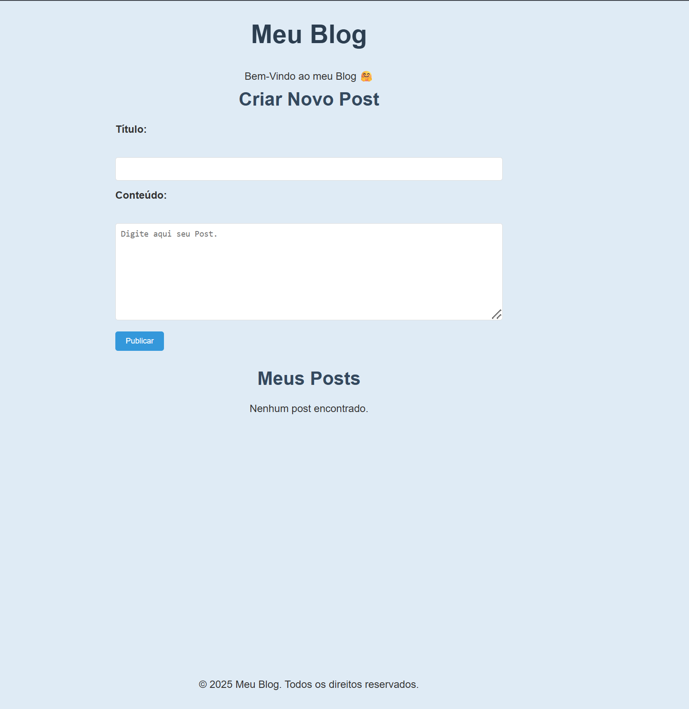
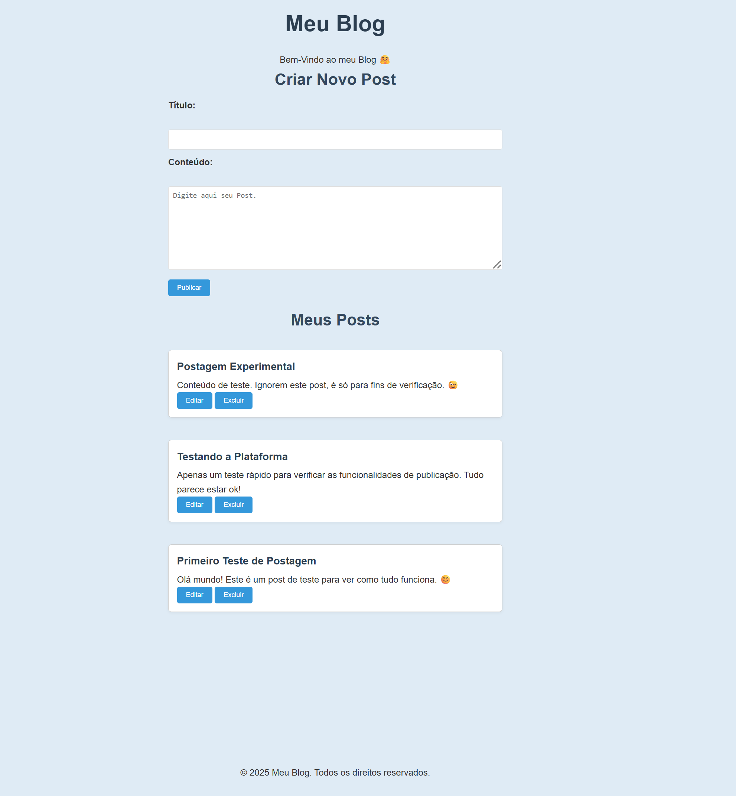
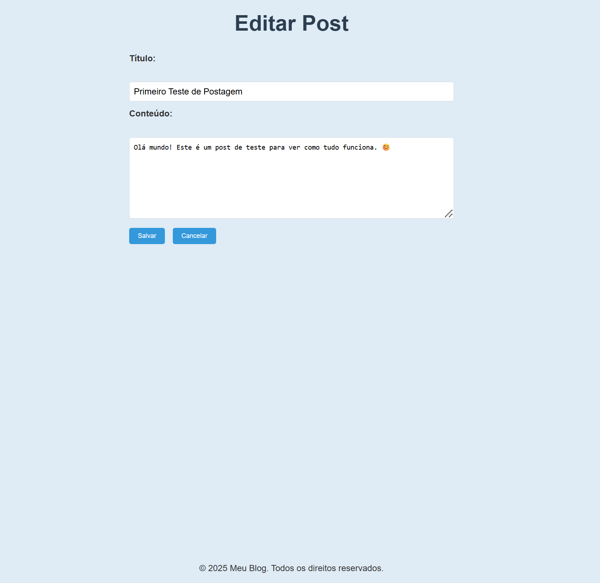

# Meu Blog com Node.js e Express

Este é um projeto simples de blog criado com Node.js, Express e EJS. Ele permite criar, visualizar, editar e excluir posts. Os dados são armazenados em memória (ou seja, não usa banco de dados), ideal para fins de aprendizado e prática de backend com rotas HTTP.

---

## Funcionalidades

- ✅ Criar novo post com título e conteúdo
- ✅ Listar todos os posts criados
- ✅ Editar um post existente
- ✅ Excluir posts individualmente

---

## Tecnologias utilizadas

- Node.js
- Express.js
- EJS (Embedded JavaScript Templates)
- HTML e CSS básico

---

## Como rodar este projeto localmente

### Pré-requisitos:
- Node.js instalado na sua máquina
- Editor de código (VS Code recomendado)
- Navegador (como o Chrome ou Firefox)

### Passos:

1. **Clone o repositório:**

```bash
git clone https://github.com/Camiloruas/blog-app-capstone-node.git
```

2. **Entre na pasta do projeto:**

```bash
cd blog-app-capstone-node
```

3. **Instale as dependências:**

```bash
npm install express ejs
```

4. **Inicie o servidor:**

```bash
node index.js
```

5. **Abra no navegador:**

Acesse [http://localhost:3000](http://localhost:3000)

---

## Estrutura de Pastas

```
blog-app-capstone-node/
│
├── public/
|     |───styles.css
├── views/           # Arquivos EJS (templates)
│   |
|   ├── index.ejs
│   └── edit.ejs
|   |──paartials/
|          |── footer.ejs           
|
├── index.js        # Arquivo principal da aplicação
|── package-loc.json
├── package.json
└── README.md
```

---

## Prints do projeto

### Página Inicial


### Tela com Post Publicado


### Formulário de edição



---

## Melhorias Futuras

- Integração com banco de dados (ex: MongoDB ou PostgreSQL)
- Validação mais avançada dos campos
- Adição de login e autenticação
- Organização das rotas em arquivos separados
- Estilização com CSS ou frameworks como Bootstrap

---

## Licença

Este projeto é livre para fins de estudo e aprendizado. Sinta-se à vontade para modificar e adaptar conforme necessário.


